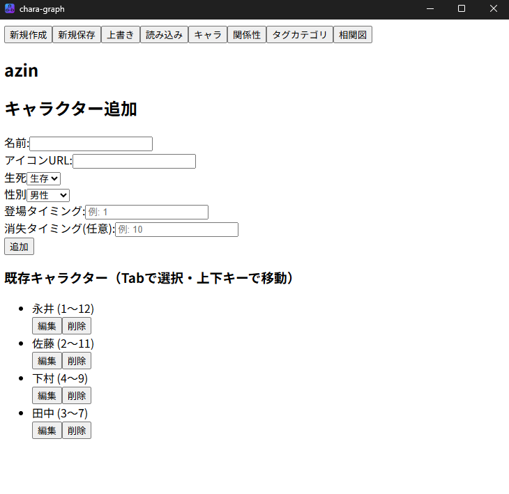
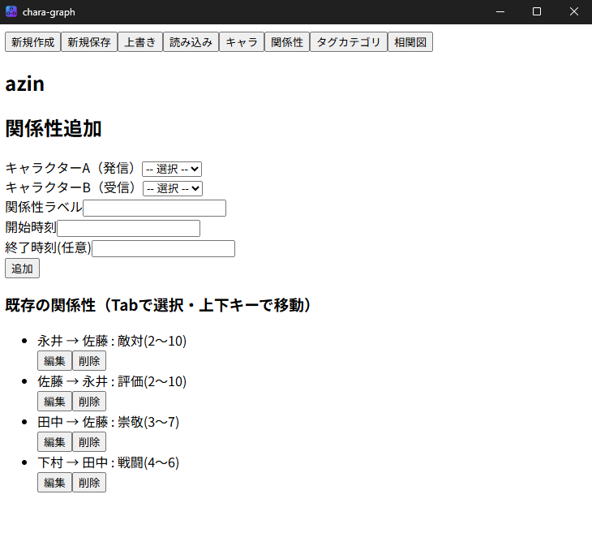
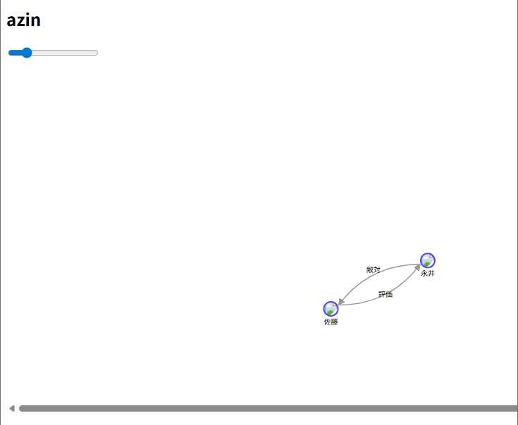
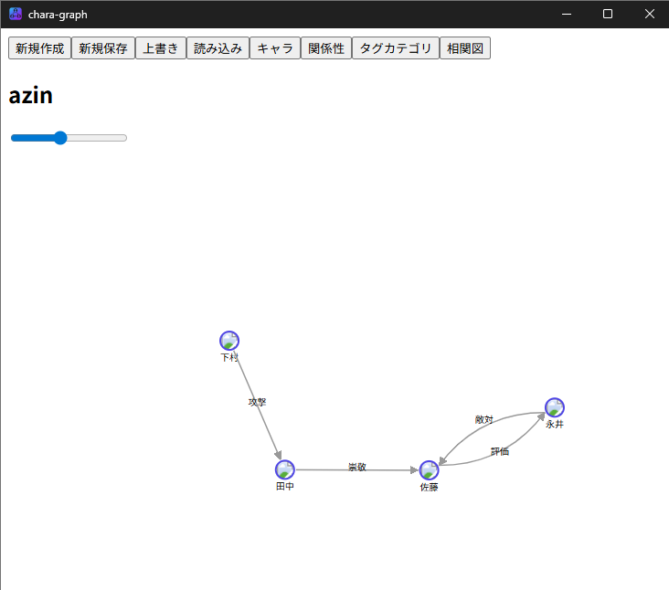

<<<<<<< HEAD
# Chara-Graph
=======
# App Overview

This application for creating character relationship diagrams that change over time.
This application runs on a local PC.

# Tauri + React + Typescript

キャラクターの動的相関図の作成デスクトップアプリ


## how to build
```bash
npm install
npm run tauri build
```

## UI






## Recommended IDE Setup

- [VS Code](https://code.visualstudio.com/) + [Tauri](https://marketplace.visualstudio.com/items?itemName=tauri-apps.tauri-vscode) + [rust-analyzer](https://marketplace.visualstudio.com/items?itemName=rust-lang.rust-analyzer)
